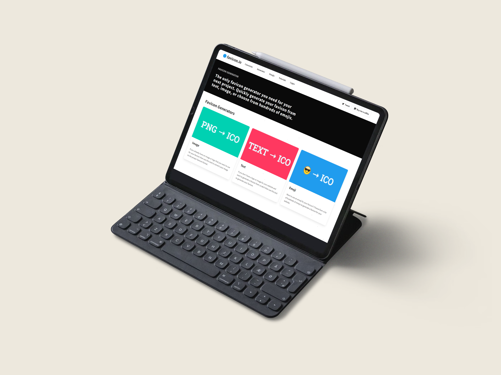

<h2 align="center">
  IEEE: G77 
  <b>Favicon Generator</b>
   
  <a href="https://favicon-developerstar.web.app" target="_blank">favicon-developerstar.web.app</a>
</h2>

  

 

 &nbsp;
 &nbsp;
 &nbsp;
 &nbsp;

<h3 align="center">
    🔹
    <a href="https://github.com/pranjal-barnwal/developerstar/issues">Report Bug</a> &nbsp; &nbsp;
    🔹
    <a href="https://github.com/pranjal-barnwal/developerstar/issues">Request Feature</a>
</h3>

## Built With

Favicon Generator, <a href="https://favicon-developerstar.web.app" target="_blank">favicon-developerstar.web.app</a> which features best in class 'ico' files generating capabilities 

    This project was built using these technologies.

    - Svelte
    - Node.js
    - Firebase

## Features

**📖 Multi-Page Layout**

**🎨 Styled with React-Bootstrap and Css with easy to customize colors**

**📱 Fully Responsive**

## **Getting Started**
Clone down this repository. You will need `node.js` and `git` installed globally on your machine.

## **🛠 Installation and Setup Instructions**
1. Installation: `npm install`

2. In the project directory, you can run: `npm run build`

Runs the app in the development mode.\
Open [http://localhost:5173](http://localhost:5173) to view it in the browser.
The page will reload if you make edits.

## **Usage Instructions**
Open the project folder and Navigate to `/src/components/`.  
You will find all the components used and you can edit your information accordingly.

## **Show your support**

Give a ⭐ if you like this website!

